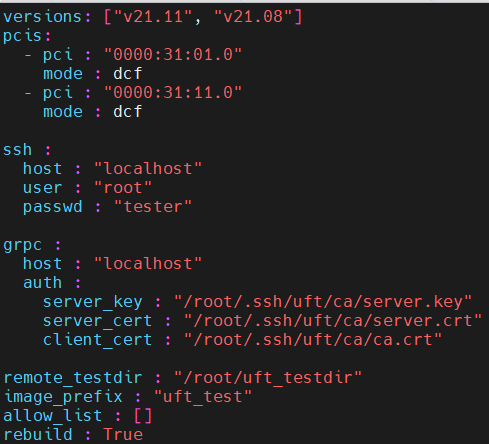
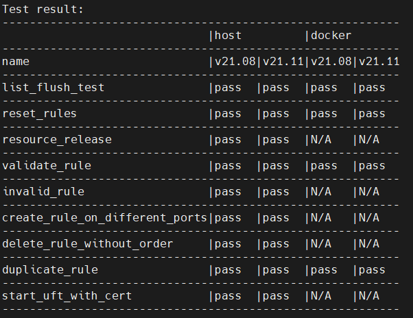

# TestSuite of UFT

## Deployment
Deploy in C/S mode, client and server can be deployed on the same host.<br>
Testsuite is started on the client side and it will automatically build DPDK & UFT & DockerImage on the server according to config.yaml.

## Requirement
server: Ubuntu/CentOS, bash ssh-server<br>
client: Ubuntu/CentOS, python3 pip3 scp<br>

## Usage
### Clone the code of UFT
``` shell
git clone <uft_repo> <uft directory>
```
### Clone the code of testsuite
``` shell
cd <uft directory>
git clone <testsuite_repo>
```
### Create DCF
```echo 4 > /sys/class/net/ens5f0/device/sriov_numvfs```<br>
```echo 4 > /sys/class/net/ens5f1/device/sriov_numvfs```<br>
```ip link set ens5f0 vf 0 trust on```<br>
```ip link set ens5f1 vf 0 trust on```<br>
```dpdk-devbind.py -b vfio-pci 0000:31:01.0  0000:31:11.0```<br>
### Edit config.yaml
                                     

`versions`: UFT support multiple DPDK versions from 21.08 to 22.07. You can specify the versions you want to test, e.g. ["v21.11", "v22.03"]<br>
`pcis`: BDF and mode of DCFs<br>
`ssh`: Configuration of ssh server, port is 22 by default<br>
`grpc`: All entries of auth must be absolute path on the server<br>
`remote_testdir`: Server location of DPDK and UFT which is built automatically. "/root/uft_testdir" by default<br>
`image_prefix`: The prefix of DockerImage's name, "uft_test" by default<br>
`allow_list`: For debugging, only the cases specified in the list will be executed, e.g. ["invalid_rule"]. If it is empty, all cases will be executed by default. <br>
`rebuild`: Force to rebuild DPDK and UFT on the server, set it to `True` only the first time. <br>

### Run
``` shell
./run.sh
```

### A simple report will be generated on the screen after all cases are executed

<br>```N/A``` means the case did not run
## Develop
### Add new case
You need to add a *.py file to the `cases` folder
```python
# must import core module
import core

# uncommonly used, the default is 0. case with small priority values will be executed first
priority = -3
# case will not be executed in docker when it is set True
disable_docker=True
# must implement it with no parameter, return True or False to indicate result of this case
def run():
    # test this case on each port
    for i, _ in enumerate(core.ports_info()):
        # reset uft on the server
        core.reset_uft()
        # generate gRPC request to the server for 'flow flush 1'
        core.execute_rule("flow flush %d" % i)
        cmd = "flow create %d ingress pattern eth / ipv4 / udp end actions vf id 3" % (i + 6)
        # generate gRPC request to the server for cmd
        resp = core.execute_rule(cmd)
        # check the result
        if not core.error_from_resp(resp):
            return False

    return True
```

### Client directory
```
    ├── cases
    ├── core
```
core: Basic support, include generating gRPC request for rules, build/start/stop UFT on the server<br>

#### Functions exported by core
```reset_uft(use_cert=False)```: Restart uft on the server with cert or not.<br>
```execute_rule(cmd)```: Generate gRPC request for cmd, return the response for it, cmd's format is the same as that used in testpmd <br>
```ports_configured()```: Return all dcfs configured<br>
##### simple helper functions for gRPC response
```error_from_resp(resp)```: Get error from any response.<br>&ensp;&ensp;&ensp;&ensp;return none if no error<br>
```ruleno_from_resp(resp)```: Extract ruleno from response corresponding to "flow create xxxxx".<br>&ensp;&ensp;&ensp;&ensp;return -1 on error<br>
```ports_from_resp(resp)```: Extract ports info from response corresponding to "listports".<br>&ensp;&ensp;&ensp;&ensp;return [(port_id, BDF, mode), ...]<br>
```rules_from_resp(resp)```: Extract rules info from response corresponding to "flow list xxx".<br>&ensp;&ensp;&ensp;&ensp;return [(rule_no, rule_description), ...] <br>

## Debug
If any result not expected, you can check the <remote_testdir> on server
### Server directory
```
├── build_log: log files of building DPDK & UFT & DockerImage
├── run_log: log files of running UFT
```
